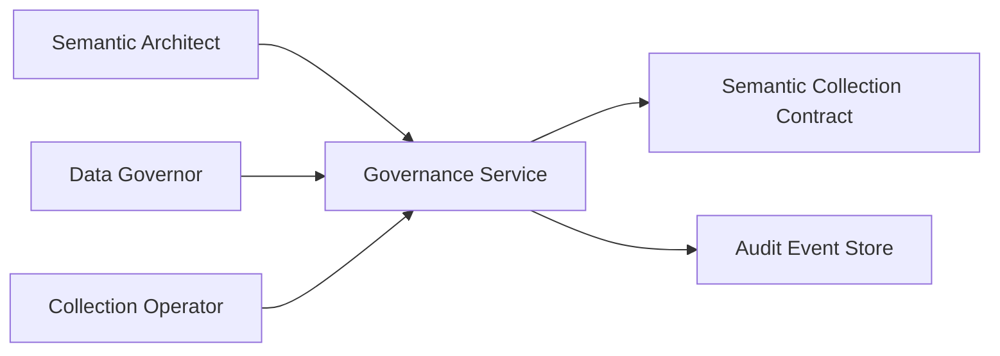
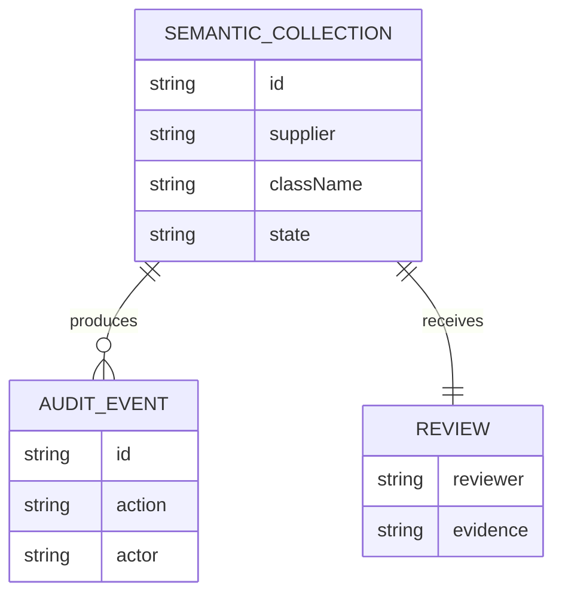
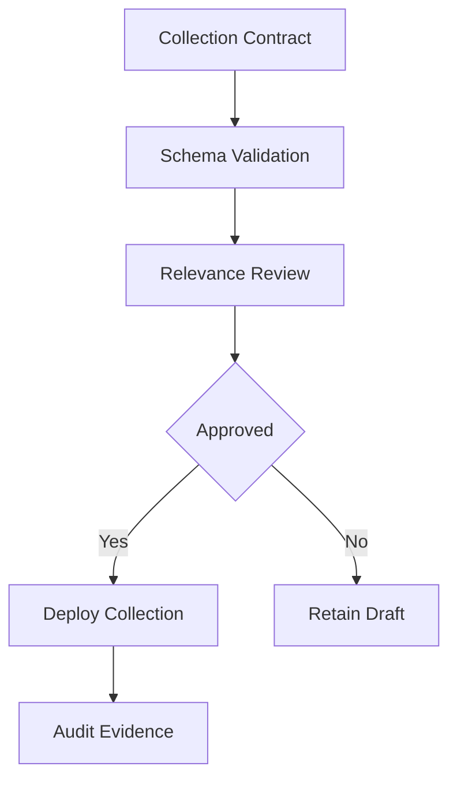
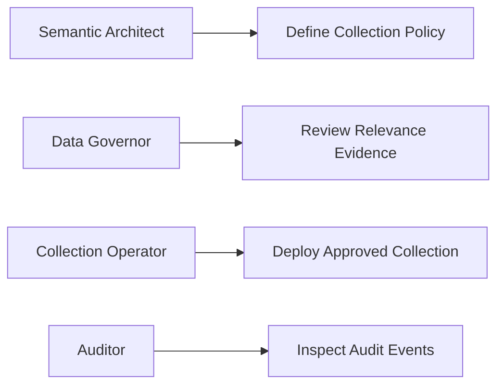
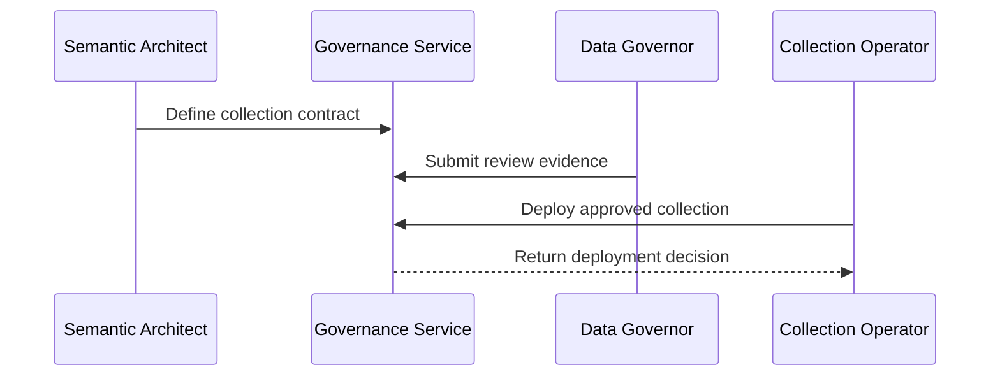

# Weaviate Supplier Semantic Search Governance Platform

## The Problem
Semantic supplier search can expose stale, weakly governed, or improperly scoped supplier information when schema changes and collection deployment occur without policy controls.

## The Solution
This service introduces an approval gate for supplier semantic collections. A semantic architect defines the collection contract, a data governor records relevance evidence, and a collection operator deploys only approved collections. Every transition produces auditable evidence.

## Live Demo & Tech Stack
The service is designed for LAN operation at `http://0.0.0.0:23400/health`. Its executable stack uses Node.js, Express, Vitest, GitHub Actions, and Weaviate-oriented semantic collection governance patterns.

## Local Setup & Run Instructions
```bash
npm install
npm test
npm start
curl http://127.0.0.1:23400/health
```

## System Documentation (Mermaid.js)
### System Architecture Diagram

### Entity-Relationship Diagram (ERD)

### Data Flow Diagram

### Use Case Diagram

### Sequence Diagram


## Owner
Created and maintained by Kholipha Ahmmad Al-Amin.
Software Engineer and AI Specialist
Founder and CEO of EquiSaaS BD
Principal Consultant at AR IT Consultancy
Full Stack Developer and SaaS Product Builder
### Official links
Portfolio: https://kholipha-ahmmad-al-amin.equisaas-bd.com/
GitHub: https://github.com/kholipha-ahmmad-al-amin
LinkedIn: https://www.linkedin.com/in/kholipha-ahmmad-al-amin
X: https://x.com/al_amin5519
Facebook: https://www.facebook.com/kholipha.ahmmad.al.amin
Instagram: https://www.instagram.com/kholipha.ahmmad.al.amin
## Ownership
This project was created and is maintained by Kholipha Ahmmad Al-Amin.

